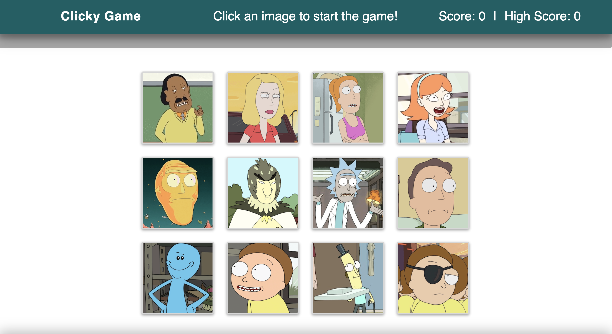

# React-Clicky-Game

**React-Clicky-Game** is a memory game that renders 12 different images to the screen. The game keeps track of the user's score. The user's score should be incremented when clicking an image for the first time. The user's score resets to 0 if the player clicks the same image more than once. Every time an image is clicked, the images rendered to the page shuffle themselves in a random order.

## Getting Started

- Clone down repo.
- Run command 'npm install' in Terminal or GitBash to install npm package dependencies needed for this app.
- Go to the directory where you cloned the repo and run npm start
- Go to localhost:3000 in your web browser

## Deployed Website
**React-Clicky-Game** is deployed to Github Pages. [Here](https://catnap89.github.io/React-Clicky-Game/) is the link to the deployed site.

## How to Play
To play our game, go to our [Website](https://catnap89.github.io/React-Clicky-Game/).
**To start the game** 
  - Click on any of the 12 rendered images.
**To score points**
  - Click on the image that hasn't been clicked before.
**Game over**
  - When a image is clicked more than once and resets the point to 0.
**To restart the game**
  - Click on any of the 12 rendered images to start again.

### Homepage

## Tech used
- Bootstrap
- JavaScript
- React
- .gitignore - to tell git not to track files such as node_modules thus they won't be committed to Github.

## Authors

* **Youngwoo Cho** - * Bootstrap / JavaScript / React  * - [Youngwoo Cho](https://github.com/catnap89)